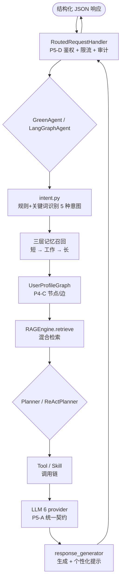
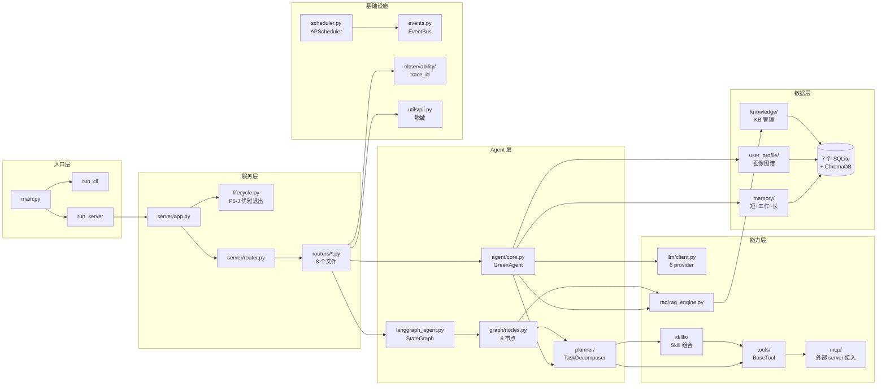
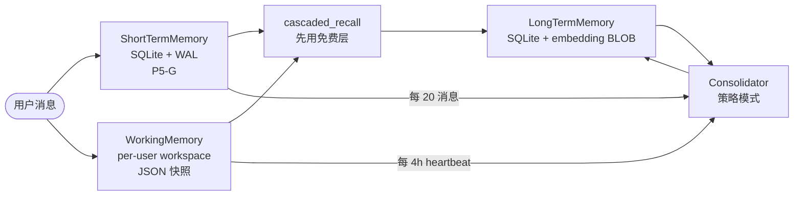

# 绿色低碳智能体 — 开发者手册(DEVELOPER)

> 本手册面向**新增功能 / 接入新 provider / 写扩展模块**的开发者。
> 适用版本:v2.0(P5-J production-ready)
> 最后更新:2026-07-18

---

## 目录

- [1. 系统架构图](#1-系统架构图)
- [2. 本地开发 setup](#2-本地开发-setup)
- [3. 添加新 LLM provider](#3-添加新-llm-provider)
- [4. 添加新 Skill](#4-添加新-skill)
- [5. 添加新 MCP server](#5-添加新-mcp-server)
- [6. 添加新 HTTP 路由](#6-添加新-http-路由)
- [7. 测试与回归](#7-测试与回归)
- [8. 调试技巧](#8-调试技巧)

---

## 1. 系统架构图

### 1.1 总体数据流(用户消息 → 响应)



### 1.2 模块依赖图



### 1.3 三层记忆数据流(P4-H)



---

## 2. 本地开发 setup

### 2.1 前置依赖

```bash
# Python 3.13+(项目用 3.13-slim,docker 内一致)
python --version  # 期望: 3.13.x

# 推荐 venv 隔离
python -m venv .venv
.venv\Scripts\activate    # Windows
# source .venv/bin/activate  # Linux/macOS

# 安装依赖(生产 + 开发)
pip install -r requirements.txt
pip install -r requirements-dev.txt
```

### 2.2 配置文件

```bash
# 1) 复制 .env.example → .env
cp .env.example .env

# 2) 编辑 .env,填入真实 API key
#    必填:OPENAI_API_KEY / ZHIPU_API_KEY / 等
#    可选:BAIDU_API_KEY / ALI_API_KEY / MiniMax_API_KEY / DEEPSEEK_API_KEY
#    政策源不强制配置,会自动用默认 mock

# 3) 校验(无占位符强校验,P5-I)
python -c "from config import settings; print('OK')"
```

### 2.3 启动

```bash
# 基础 Web(端口 8000)
cd src && python main.py

# LangGraph 实验模式
cd src && python main.py --use-langgraph --use-react

# 命令行交互
cd src && python main.py --cli

# 健康检查
curl http://localhost:8000/api/health
curl http://localhost:8000/api/ready
curl http://localhost:8000/api/metrics
```

### 2.4 Docker 开发模式

```bash
# 构建
docker build -t green-agent:dev .

# 运行(挂载源码,代码改动立刻生效)
docker run --rm -p 8000:8000 \
  -v $(pwd)/src:/app/src:ro \
  -v $(pwd)/data:/app/data \
  --env-file .env \
  green-agent:dev
```

---

## 3. 添加新 LLM provider

**位置**: `src/llm/client.py`(所有 6 provider 同文件)

### 3.1 模板(参考现有 6 provider)

```python
class MyProviderClient(LLMClient):
    """P5-A 统一 LLMResponse 契约(P5-A.2 必须)"""

    def __init__(self, api_key: Optional[str] = None, base_url: Optional[str] = None):
        self.api_key = api_key or os.environ.get("MYPROVIDER_API_KEY", "")
        self.base_url = base_url or os.environ.get(
            "MYPROVIDER_BASE_URL", "https://api.myprovider.com/v1"
        )
        self.model = os.environ.get("MYPROVIDER_MODEL", "my-model-001")
        # P5-C: SSL 验证(默认严格,INSECURE_SKIP_VERIFY=true 才放行)
        import httpx

        self._client = httpx.Client(
            base_url=self.base_url,
            timeout=_llm_timeout(),  # 默认 30s
            verify=not _is_insecure(),
        )

    def chat(self, messages: List[Dict[str, str]], **kwargs) -> LLMResponse:
        """
        必须返回 LLMResponse dataclass,字段:
            content      str       文本内容
            latency_ms   float     调用耗时
            request_id   str       服务端 request_id(可追踪)
            error        str       错误信息(无错则为 None)
            usage        dict      token 用量(可选)
        """
        import time

        trace_id = new_trace_id()
        start = time.time()
        try:
            # 调 API(P5-C: 3 次重试 + 1s→2s→4s 指数退避)
            from tenacity import retry, stop_after_attempt, wait_exponential

            @retry(stop=stop_after_attempt(3), wait=wait_exponential(min=1, max=4))
            def _do_call():
                return self._client.post(
                    "/chat/completions",
                    json={
                        "model": self.model,
                        "messages": messages,
                        "temperature": kwargs.get("temperature", 0.7),
                        "max_tokens": kwargs.get("max_tokens", 2048),
                    },
                    headers={
                        "Authorization": f"Bearer {self.api_key}",
                        "X-Trace-Id": trace_id,
                    },
                )

            resp = _do_call()
            resp.raise_for_status()
            data = resp.json()
            latency_ms = (time.time() - start) * 1000

            # P5-B: 结构化日志
            _logger.info(
                "llm_call",
                extra={
                    "trace_id": trace_id,
                    "provider": "myprovider",
                    "model": self.model,
                    "latency_ms": round(latency_ms, 2),
                    "usage": data.get("usage", {}),
                    "request_id": resp.headers.get("x-request-id", trace_id),
                },
            )

            return LLMResponse(
                content=data["choices"][0]["message"]["content"],
                latency_ms=latency_ms,
                request_id=resp.headers.get("x-request-id", trace_id),
                error=None,
                usage=data.get("usage", {}),
            )

        except Exception as e:
            latency_ms = (time.time() - start) * 1000
            _logger.error(
                "llm_call_failed",
                extra={
                    "trace_id": trace_id,
                    "provider": "myprovider",
                    "latency_ms": round(latency_ms, 2),
                    "error": str(e)[:200],
                },
            )
            return LLMResponse(
                content="",
                latency_ms=latency_ms,
                request_id=trace_id,
                error=f"{type(e).__name__}: {e}",
            )
```

### 3.2 注册到 BayesianModelRouter

在 `src/llm/client.py` 找到 `BayesianModelRouter.__init__`,添加:

```python
MyProviderClient,  # 末尾加一行
```

### 3.3 环境变量 + 配置校验

```bash
# .env.example 增加:
MYPROVIDER_API_KEY=__SET_ME__
MYPROVIDER_BASE_URL=https://api.myprovider.com/v1
MYPROVIDER_MODEL=my-model-001
```

`src/config.py` 的 Pydantic Settings 添加 `MYPROVIDER_API_KEY` 字段(P5-I 启动强校验)。

### 3.4 测试

```python
# tests/test_myprovider.py
import pytest
from llm.client import MyProviderClient


def test_myprovider_chat_returns_llmresponse():
    client = MyProviderClient(api_key="test-key")
    resp = client.chat([{"role": "user", "content": "hi"}])
    assert resp.content
    assert resp.latency_ms > 0
    # 错误时
    assert resp.error is None or resp.content  # mock 时 content 不空
```

---

## 4. 添加新 Skill

**位置**: `src/agent/skills/builtin.py`(已注册 3 个示例)

### 4.1 模板

```python
from agent.skills.skill import Skill, SkillContext
from agent.tools.base import BaseTool, ToolResult


class MySkill(Skill):
    """P5 风格的 Skill 抽象 — 组合多个 BaseTool 形成高级能力"""

    name = "my_skill"
    description = "完成 X 业务的高级技能(组合 tool_a + tool_b)"
    category = "custom"

    @property
    def tools(self) -> List[BaseTool]:
        # 延迟加载避免循环依赖
        from agent.tools.extended import ToolA, ToolB

        return [ToolA(), ToolB()]

    def execute(self, context: SkillContext, **kwargs) -> Dict[str, Any]:
        """
        执行流程:
            1) 调用 tool_a 获取中间结果
            2) 调 LLM 处理
            3) 调用 tool_b 落地
        """
        # 1) 取数据
        tool_a = self.tools[0]
        intermediate = tool_a.execute(kwargs.get("query"))

        # 2) LLM 处理(用 context 中的 LLM client)
        from llm.client import get_default_client

        client = get_default_client()
        llm_response = client.chat(
            messages=[
                {"role": "system", "content": "你是绿色低碳助手"},
                {"role": "user", "content": str(intermediate)},
            ]
        )

        # 3) 落地(可选)
        tool_b = self.tools[1]
        tool_b.execute({"data": llm_response.content, "user_id": context.user_id})

        return {
            "skill": self.name,
            "result": llm_response.content,
            "tools_used": [t.name for t in self.tools],
            "latency_ms": llm_response.latency_ms,
        }
```

### 4.2 注册

在 `src/server/app.py` 的 `_register_all_tools_and_skills()` 找到:

```python
for SkillCls in [LowCarbonTravelSkill, PolicyQuerySkill, ProfileUpdateSkill]:
```

改为:

```python
for SkillCls in [LowCarbonTravelSkill, PolicyQuerySkill, ProfileUpdateSkill, MySkill]:
```

### 4.3 测试

```python
# tests/test_my_skill.py
from agent.skills.builtin import MySkill
from agent.skills.skill import SkillContext


def test_my_skill_execute():
    skill = MySkill()
    ctx = SkillContext(user_id="test_user", message="帮我查 X")
    result = skill.execute(ctx, query="X")
    assert result["skill"] == "my_skill"
    assert result["result"]
```

---

## 5. 添加新 MCP server

**位置**: `config/mcp_servers.yaml`(声明式配置,启动时拉起)

### 5.1 配置文件

```yaml
# config/mcp_servers.yaml
servers:
  - name: github_mcp
    command: npx -y @modelcontextprotocol/server-github
    env:
      GITHUB_PERSONAL_ACCESS_TOKEN: ${GITHUB_TOKEN}
    enabled: true
    timeout_seconds: 30

  - name: my_custom_mcp
    command: python /path/to/my_mcp_server.py
    args: ["--port", "8765"]
    enabled: false  # 暂时关闭
```

### 5.2 启动

```bash
# 启动后 mcp_registry 会自动 connect_all_blocking() 加载配置
python src/main.py

# 看哪些 MCP server 已连接
curl http://localhost:8000/api/health | python -m json.tool
# 输出 mcp_servers 字段
```

### 5.3 写 MCP server(给外部消费者用)

```python
# my_mcp_server.py — 用项目内置 MCPServer
from mcp import MCPServer, MCPTool

# 1) 定义工具
def get_carbon_footprint(user_id: str) -> dict:
    return {"carbon_kg": 12.5, "user_id": user_id}

# 2) 注册 + 启动
server = MCPServer(name="green_agent_tools")
server.register_tool(
    name="get_carbon_footprint",
    description="查询用户碳足迹",
    parameters={
        "user_id": {"type": "string", "required": True}
    },
    handler=get_carbon_footprint,
)

if __name__ == "__main__":
    server.serve_stdio()  # stdio JSON-RPC 2.0
```

---

## 6. 添加新 HTTP 路由

**位置**: `src/server/routers/<resource>.py`(按资源拆 8 个文件)

### 6.1 注册新路由

```python
# src/server/routers/my_resource.py
from server.router import get_registry, Route


def my_handler(handler):
    """GET /api/my-resource 处理器"""
    handler.send_json({"ok": True})


def register_my_routes(registry=None):
    registry = registry or get_registry()
    registry.add_route(
        Route(
            method="GET",
            path="/api/my-resource",
            handler=my_handler,
            auth_required=True,  # P5-D: 敏感端点 True
        )
    )
```

### 6.2 在 `routers/__init__.py` 注册

```python
# src/server/routers/__init__.py
def register_all_routes(registry):
    from . import system, auth, profile, my_resource  # ← 加一行
    system.register(registry)
    auth.register(registry)
    profile.register(registry)
    my_resource.register_my_routes(registry)
```

---

## 7. 测试与回归

### 7.1 跑全量

```bash
# 全量 33 个测试文件,约 5 分钟
pytest tests/ -v

# 只跑 P5 系列
pytest tests/test_p5*.py -v

# 只跑某一个文件
pytest tests/test_p5i_security.py -v

# 并行(需 pytest-xdist)
pytest tests/ -n auto
```

### 7.2 评估

```bash
# RAG 检索质量评估(P5-G,50 条 golden set)
python scripts/eval_retrieval.py

# 综合健康检查
python scripts/doctor.py
```

### 7.3 CI gate

```bash
# 跑全量 + 检索评估,任何失败返非 0 退出码
pytest tests/ -v --tb=short && python scripts/eval_retrieval.py
```

---

## 8. 调试技巧

### 8.1 看 trace

```bash
# 看某个请求的完整链路(从 dispatch 到 LLM 响应)
grep '"trace_id": "abc123def456"' data/logs/app.log

# JSON pretty-print
tail -f data/logs/app.log | python -m json.tool --no-ensure-ascii
```

### 8.2 关掉限流跑测试

```bash
# .env 加:
RATE_LIMIT_ENABLED=false
INSECURE_SKIP_VERIFY=true
LLM_MOCK=true   # 强制 mock,跳过真实 API
```

### 8.3 清缓存

```bash
# RAG 重建
curl -X POST http://localhost:8000/api/knowledge/reload

# 看进度
curl http://localhost:8000/api/rag/status
```

### 8.4 性能分析

```bash
# 慢请求(> 1s)
grep '"latency_ms": [0-9]\{4,\}' data/logs/app.log | tail -20

# 错误率
grep -c '"level": "ERROR"' data/logs/app.log
```

### 8.5 Python REPL 调试

```python
# 在 src/ 目录下
import sys
sys.path.insert(0, ".")

from agent.core import GreenAgent
agent = GreenAgent(
    knowledge_base_path="../knowledge_base",
    enable_rag=True,
    use_llm=False,  # 跳过 LLM
)
resp = agent.chat("test_user", "碳交易是什么?")
print(resp.message)
```

---

**作者**:绿色低碳智能体项目组
**最后更新**:2026-07-18(P5-J 部署工件收口)
**反馈**:GitHub Issues 或 `make doctor` 检查项目健康
