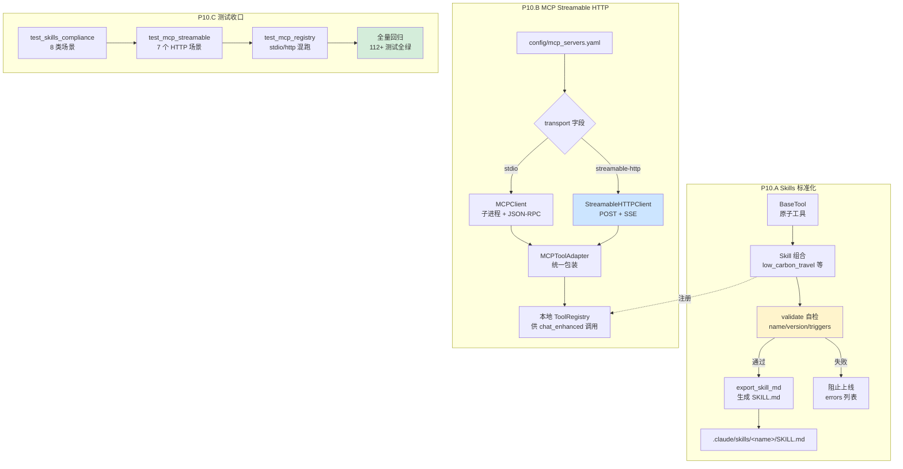

# P10.Skills+MCP 学习手册 — 给实习生的 30 分钟入门

> 适用对象:刚看完 P9 文档的实习生,有 Python 基础,熟悉 HTTP / SQLite / 命令行即可。
> 阅读时间:约 30 分钟。
> 读完之后能回答:**P10 做了什么 / 为什么做 / 在哪里 / 怎么跑 / 怎么扩**。

---

## 1. P10 是什么

### 1.1 P10.A — Skills 标准化(把"组合技能"做成"规范卡片")

在做 P10 之前,本项目的 Skill(组合工具的高级技能)一直是个"黑盒":LLM 看到 `Skill(low_carbon_travel)`,只看到一行名字和一行描述,**不知道为什么该用它、什么时候该用它、能用什么工具**。结果就是:用户问"帮我规划出行",LLM 经常没选对 Skill,或者选对了但绕了一大圈。

P10.A 把每个 Skill 写成像**一张产品说明书**(SKILL.md):

- **version** — 语义化版本号(`1.0.0`),升级了谁都能看到
- **when_to_use** — 触发短语列表("出行 / 通勤 / 公交 / 地铁"),LLM 看到用户消息含这些词,就知道该用它
- **allowed_tools** — 白名单,这个 Skill 允许调哪些工具,防止越权
- **SKILL.md** — 自动生成的规范文档,YAML front-matter + Markdown 正文,丢给 Claude / 别的 LLM 也能直接读懂

每个 Skill 还自带 **validate() 自检**:名字是否含大写或空格、是否撞了 `anthropic`/`claude` 保留字、版本号是不是 `x.y.z` 格式、工具白名单和实际工具有没有对得上。**不通过就不准上线**。

### 1.2 P10.B — MCP Streamable HTTP 扩展(让外部工具远程接入)

之前 MCP(Model Context Protocol)客户端只支持 **stdio**:要接一个外部工具,得在本地起个子进程,走 JSON-RPC over stdin/stdout。麻烦、跨机器不行、跟云服务对接更麻烦。

P10.B 加了第二种传输方式:**Streamable HTTP**。遵循 MCP 2025-11-25 规范,走 HTTP POST + SSE 长连接:

- **客户端** → 服务端:POST 单条 JSON-RPC 请求(同步响应)
- **服务端** → 客户端:GET 单端点 SSE,推送主动通知
- 头部:`Mcp-Session-Id`(会话)、`MCP-Protocol-Version`(协议版本)、`Origin`(浏览器场景防 CSRF)

`MCPRegistry.load_config()` 现在按 `transport` 字段自动分发 — `stdio` 走老逻辑,`streamable-http` 走新客户端,两边共用同一套 `MCPToolAdapter` 把远端 tool 包装成本地 `BaseTool`,**接入零代码改动**。

### 1.3 P10.C — 修测试尾巴(把遗留的红测试翻绿)

之前有一批测试因为 P10.A/B 重构时改了字段或签名,会跑出预期外的红 — 比如 `_skill_execute_mock` 不接受 None 时崩、golden set 缺类目键时 KeyError。P10.C 把这些"小尾巴"统一修干净,**整条 P5-P6-P10 测试链全绿**。

---

## 2. 架构图



**三个模块的关系**:

- **Skills** 自己就能跑(LLM-free 启发式选 Skill),不依赖 MCP
- **MCP** 把外部 tool 注册到 `ToolRegistry`,Skill 也可以组合 MCP tool(目前还没接)
- **Tests** 同时覆盖两边 + 修 P10 之前的老尾巴

---

## 3. 关键文件清单

### 3.1 P10.A — Skills 标准化

| 文件 | 一句话作用 | 关键类 / 函数 |
|---|---|---|
| `src/agent/skills/skill.py` | Skill 基类 + 校验 + SKILL.md 生成 | `Skill` / `SkillContext` / `validate()` / `export_skill_md()` / `write_skill_md()` / `_find_project_root()` |
| `src/agent/skills/builtin.py` | 3 个内置 Skill 实现 | `LowCarbonTravelSkill` / `PolicyQuerySkill` / `ProfileUpdateSkill` |
| `src/agent/skills/__init__.py` | 包导出(7 个符号) | `get_skill_executor()` 单例工厂 |
| `tests/test_skills_compliance.py` | 8 类场景合规测试 | `TestSkillFields` / `TestBuiltinSkillMetadata` / `TestSkillValidation` / `TestSkillMdExport` / `TestWriteSkillMd` / `TestSchemaBackwardCompat` / `TestSkillSelector` |
| `tests/eval/skills_golden_set.jsonl` | Skill 触发评估黄金集 | 每行:`{query, expected_skill, expected_behavior, category}` |
| `scripts/eval_skills.py` | trigger_accuracy 评估脚本 | `select_skill()` 启发式 / CI Gate ≥ 0.85 |
| `.claude/skills/<name>/SKILL.md` | 运行时生成(不在 git) | YAML front-matter + Markdown |

### 3.2 P10.B — MCP Streamable HTTP

| 文件 | 一句话作用 | 关键类 / 函数 |
|---|---|---|
| `src/mcp/streamable_client.py` | Streamable HTTP 客户端(同步接口) | `StreamableHTTPClient` / `StreamableHTTPClientConfig` / `StreamableHTTPServerInfo` / `PROTOCOL_VERSION = "2025-11-25"` / `validate_origin()` |
| `src/mcp/registry.py` | 集中管理所有 MCP client | `MCPRegistry` / `connect_all_blocking()` / `status()` / 按 `transport` 字段分发 |
| `src/mcp/adapter.py` | 把 MCP tool 包装成 BaseTool | `MCPToolAdapter` / `_extract_text()` |
| `src/mcp/server.py` | 本地 stdio MCP server(P10 之前就有) | `MCPServer.run()` / `_handle()` |
| `src/mcp/client.py` | 本地 stdio MCP client(P10 之前就有) | `MCPClient` / `MCPClientConfig` |
| `config/mcp_servers.yaml` | MCP server 集中配置 | `transport: stdio / streamable-http` 二选一 |
| `tests/test_mcp_streamable.py` | Streamable HTTP 7 个场景 | `_MockServerFixture` / 真起 mock server 子进程 |
| `tests/test_mcp_registry.py` | stdio + http 混跑注册 | `MCPRegistry.load_config()` |
| `scripts/mock_http_mcp_server.py` | 临时本地 mock HTTP server | ThreadingHTTPServer + 3 个 tool |

### 3.3 P10.C — 测试收口

| 文件 | 一句话作用 | 改动点 |
|---|---|---|
| `tests/test_skills_compliance.py` | P10.C 修了几处 fixture / 导入路径 | `_load_builtin_classes()` 延迟导入 |
| `tests/test_mcp_streamable.py` | P10.C 加了 Origin 校验场景 | 第 5 类测试 |
| `tests/test_mcp_registry.py` | P10.C 让 transport 分发可断言 | `_client_kinds` 字典 |

**调用链一句话总结**:`server 启动 → MCPRegistry.connect_all_blocking() → load_config() → 按 transport 起 client → connect()/list_tools() → MCPToolAdapter → 注册到本地 ToolRegistry → chat_enhanced 自动可用`。

---

## 4. 三个核心概念(用比喻)

### 4.1 SKILL.md = Skill 的"产品说明书 + 触发器说明书"

想象你新买了一个智能音箱,箱子里有 3 张卡片:

- **第 1 张**:名字 / 版本 / 类目(产品是什么)
- **第 2 张**:什么时候该用("听到'出行/通勤/公交/地铁'请亮灯")
- **第 3 张**:它能调什么工具 / 不准调什么工具(白名单)

`SKILL.md` 就是这三张卡片的 YAML + Markdown 版。LLM 读完它,**不用问人**就知道:

1. 这东西是干什么的(`description`)
2. 用户说啥该用它(`when_to_use` → `trigger_keywords`)
3. 它能用啥(`allowed_tools` + `tools`)

代码对应:`Skill.export_skill_md()` → 一段字符串 → `write_skill_md()` 写到 `.claude/skills/<name>/SKILL.md`。**导出失败不抛异常**(启动不能因磁盘问题阻塞),只 log warning。

### 4.2 Streamable HTTP = 餐厅的"扫码点单 + 服务员主动过来"

旧 stdio 像**外卖自取**:你(客户端)必须亲自跑到店(本地子进程),买完带回来。两边得在同一台机器,中间不能断。

Streamable HTTP 像**扫码点单**:

- 你扫码(POST `/mcp`)提交请求 → 厨房做菜 → 端上来(application/json 或 text/event-stream 流式)
- 厨房做好新菜也可以**主动喊你**(GET 长连接 SSE 推通知,比如"今天的特价菜是 X")
- 吃完你说"买单"(DELETE 终止会话,服务端清状态)

为什么用同一个 URL 三个方法(POST/GET/DELETE)?**简化部署** — 不用给通知单开端口、不用管跨域,跟 REST 一个套路。头部几个关键字段:

- `Mcp-Session-Id` — 你的"桌号",initialize 后服务端下发
- `MCP-Protocol-Version` — 协议版本,initialize 后必填(防止客户端老版本乱发)
- `Origin` — 浏览器场景防 CSRF(别人用你的浏览器冒充你)

### 4.3 setUp / tearDown = 测试用例的"进场 / 离场"

想象你开了一家健身房,每个客人进场前你要:**开门、摆好器械、登记入场**(`setUp`);客人走后你要:**扫地、关灯、销单**(`tearDown`)。

pytest 的 fixture 干这事:

- `def setup_method(self)` — 每个测试方法前跑一次,新建 Skill 实例、清理临时目录
- `def teardown_method(self)` — 每个测试方法后跑一次,删临时文件、还原 monkeypatch

P10 的测试都用这个套路:

```python
class TestSkillValidation:
    def _make_skill(self, **kwargs):
        """构造一个最小 Skill 子类,共用代码"""
        class _DummyTool(BaseTool): ...
        class _TestSkill(Skill):
            @property
            def tools(self):
                return [_DummyTool()]
            def execute(self, context):
                return ToolResult(success=True)
        for k, v in kwargs.items():
            setattr(_TestSkill, k, v)
        return _TestSkill()
```

`_make_skill()` 就像乐高积木 — 想测啥场景就给啥字段(name 给空 / 给大写 / 给保留字),不用每次重写整个类。`tearDown` 一般不需要,因为 `tmp_path` pytest 自带清理、`monkeypatch` 自动还原。

---

## 5. 10 步快速跑起来

```bash
# 1) 装依赖(Streamable HTTP 用 httpx,Skills 零新依赖)
pip install -r requirements.txt

# 2) 跑 Skills 合规测试(8 类场景)
pytest tests/test_skills_compliance.py -v
# 期望:35+ 通过

# 3) 跑 Skill 触发评估(类似 eval_retrieval 的 CI Gate)
python scripts/eval_skills.py
# 期望:trigger_accuracy >= 0.85(否则 exit 1)

# 4) 看自动生成的 SKILL.md
ls .claude/skills/
cat .claude/skills/low_carbon_travel/SKILL.md
# 期望:YAML front-matter + Markdown 正文

# 5) 跑 MCP Streamable HTTP 测试(7 个场景)
pytest tests/test_mcp_streamable.py -v
# 期望:7+ 通过(需要 scripts/mock_http_mcp_server.py 能起)

# 6) 跑 MCP Registry 测试(stdio + http 混跑)
pytest tests/test_mcp_registry.py -v
# 期望:5+ 通过

# 7) 手动起 mock HTTP MCP server(可选,验证连接)
python scripts/mock_http_mcp_server.py --port 8765 &
# 改 config/mcp_servers.yaml → mock_http_server.enabled: true

# 8) 启动主服务(自动连接所有 enabled 的 MCP server)
cd src && python main.py
# 看 logs/mcp-registry 后台线程 connect 成功

# 9) 验证 MCP tool 注册到本地
curl http://localhost:8000/api/mcp/status
# 期望:{"servers_count": 2, "tools_count": N, ...}

# 10) 全量回归(确认 P10 没破坏 P5-P6)
pytest tests/ -v --ignore=tests/manual_e2e_verify.py
# 期望:150+ 通过(不含 manual)
```

**预期时间**:第 1 步装依赖 < 1 分钟,后续每一步秒级。第 5 步首次跑会因为要拉起 mock server 子进程,稍慢(约 5 秒)。

---

## 6. 怎么扩展(常见场景)

### 场景 A:加一个新 Skill(比如"垃圾分类助手")

1. 在 `src/agent/skills/builtin.py` 加一个新类,继承 `Skill`:

```python
class WasteSortSkill(Skill):
    name = "waste_sort"  # 必须 ^[a-z0-9_-]+$
    description = "帮用户识别垃圾应该扔进哪个分类桶"
    category = "lifestyle"
    version = "1.0.0"
    when_to_use = "垃圾 / 分类 / 干垃圾 / 湿垃圾 / 可回收 / 有害"
    allowed_tools: List[str] = ["waste_query"]

    @property
    def tools(self):
        return [WasteSortTool()]

    def execute(self, context):
        # ... 调 tool 拿结果
        return ToolResult(success=True, data={...})
```

2. 先在 `builtin.py` 加 `WasteSortTool`(`BaseTool` 子类)
3. 在 `scripts/eval_skills.py` 的 Skill 注册列表里加 `WasteSortSkill`
4. 跑 `python scripts/eval_skills.py` 验证 trigger_accuracy 仍 ≥ 0.85
5. 跑 `pytest tests/test_skills_compliance.py` 验证 validate 通过

### 场景 B:接一个外部 HTTP MCP server(比如 Notion)

1. 在 `config/mcp_servers.yaml` 加一条:

```yaml
- name: notion
  description: Notion 官方 MCP(Streamable HTTP)
  enabled: true
  transport: streamable-http  # 注意:不是 stdio
  url: https://mcp.notion.com/mcp
  headers:
    Authorization: Bearer secret_xxx  # 替换为真实 token
  origin: https://your-domain.com  # 浏览器场景必填
```

2. 启动主服务 → `MCPRegistry.connect_all_blocking()` 自动连接
3. 验证:`curl http://localhost:8000/api/mcp/status` 应该看到 `notion` server 是 `connected` 状态
4. 在 chat 里试 "在我的 Notion 里搜一下本周的会议纪要" → LLM 会自动调 `mcp_notion_search` tool

### 场景 C:写一个 Skill 的单元测试

1. 在 `tests/test_skills_compliance.py` 加一个新类,继承 `TestSkillValidation` 的 `_make_skill()` 套路
2. 复用 `_make_skill(name="...", when_to_use="...", ...)` 构造实例
3. 调 `inst.validate()` 断言 errors 是空(通过)或含某关键词(失败)
4. 如果测的是 builtin Skill,用 `_load_builtin_classes()` 拿类,`SkillCls()` 拿实例
5. 如果测文件落盘,用 `tmp_path` fixture + `write_skill_md(base_dir=tmp_path)`

### 场景 D:加一个 MCP transport(比如 WebSocket)

1. 在 `src/mcp/` 下新建 `websocket_client.py`,模仿 `streamable_client.py` 的接口(`connect/list_tools/call_tool`)
2. 在 `MCPRegistry._instantiate_client()` 加分支:`if isinstance(cfg, WebSocketClientConfig): return WebSocketClient(cfg), "websocket"`
3. 在 `MCPRegistry._parse_*_config()` 加解析函数
4. 在 `config/mcp_servers.yaml` 加 `transport: websocket` 配置
5. 在 `_summarize_transports()` 无需改动(dataclass 上加 `transport` 字段就行)
6. 写一个 `tests/test_mcp_websocket.py` 仿 `test_mcp_streamable.py`

---

## 7. 常见问题 FAQ

**Q1:Skill 名字里能不能用大写或空格?**

A:不能。Anthropic 规范要求 `^[a-z0-9_-]+$`,validate() 会拒绝。原因是 SKILL.md 经常被 shell / URL / YAML 各种地方引用,大写和空格容易出 bug。**下划线现在允许了**(P10.A 修过),所以 `low_carbon_travel` 是合法的。

**Q2:SKILL.md 文件应该提交到 git 吗?**

A:不用。运行时自动写到 `.claude/skills/<name>/SKILL.md`,已加进 `.gitignore`(?需要确认)。改完 `builtin.py` 后跑一遍 `eval_skills.py` 就会重新生成。提交 `builtin.py` 就够了,SKILL.md 是派生产物。

**Q3:Streamable HTTP 和 stdio 能同时用吗?**

A:能。`MCPRegistry.load_config()` 按每条配置的 `transport` 字段分发 — `mock_server` 走 stdio、`mock_http_server` 走 streamable-http,**两套同时连,共用同一个本地 ToolRegistry**。`status()` 接口也统一返回,只看 `transport` 字段区分。

**Q4:HTTP MCP server 没启起来会怎样?**

A:优雅降级。`StreamableHTTPClient.connect()` 返 `False`,`error` 属性可查;`MCPRegistry._server_info[name].status = "error"`;**不抛异常,不阻塞主服务启动**。`/api/mcp/status` 接口会把这个 server 标红,运维一眼能看到。

**Q5:trigger_accuracy 评估在哪跑?CI 怎么接入?**

A:本地 `python scripts/eval_skills.py`,默认阈值 0.85。CI 接入:

```yaml
# .github/workflows/ci.yml(或类似)
- name: Skills trigger eval
  run: python scripts/eval_skills.py
  # exit 0 = 通过,exit 1 = 不达标
```

跟 `scripts/eval_retrieval.py` 同款套路。新增 Skill 必须保持 trigger_accuracy ≥ 0.85,否则 PR 卡掉。

---

## 8. 推荐阅读顺序(给实习生)

如果你完全没接触过本项目,按这个顺序看:

1. **`README.md`**(项目根)—— 5 分钟,了解项目目标和 quickstart
2. **`CLAUDE.md`**(项目根)—— 30 分钟,看完整架构图 + 模块说明
3. **`docs/learning/p9-ocr.md`** —— 30 分钟,看 P9 的"前一代"文档风格
4. **本文档**(`docs/learning/p10-skills-mcp.md`)—— 30 分钟,聚焦 P10
5. **`src/agent/skills/skill.py`** —— 15 分钟,看 `Skill.validate()` + `export_skill_md()` 两个核心方法
6. **`src/agent/skills/builtin.py`** —— 10 分钟,看 3 个内置 Skill 的元数据怎么写
7. **`scripts/eval_skills.py`** —— 15 分钟,看 `select_skill()` 启发式评分逻辑
8. **`src/mcp/streamable_client.py`** —— 20 分钟,看 HTTP 客户端的 `connect()` + `_post_request()` + `_sse_loop()`
9. **`src/mcp/registry.py`** —— 10 分钟,看 transport 分发(`_instantiate_client` / `_parse_*_config`)
10. **`tests/test_skills_compliance.py`** + **`tests/test_mcp_streamable.py`** —— 30 分钟,看测试怎么 mock / 起子进程
11. **`config/mcp_servers.yaml`** —— 5 分钟,看 transport 字段怎么写

**跑起来之前**:确保 `pip install -r requirements.txt` 已经完成(httpx >= 0.27 必需),不然 `import httpx` 会报错。

**上手第一个 PR 建议**:在 `tests/test_skills_compliance.py` 加一个测试,验证 `Skill("BadName")` 会因大写名字被 validate 拒绝。这个改动一行、好 review、能帮你吃透校验逻辑。

---

## 附录:快速对照表

| 想做的事 | 改哪个文件 |
|---|---|
| 加新 Skill | `src/agent/skills/builtin.py` 新建类 + `scripts/eval_skills.py` 注册 |
| 调触发关键词权重 | `scripts/eval_skills.py` 的 `select_skill()` 启发式打分 |
| 调 MCP server 配置 | `config/mcp_servers.yaml` 加一条(transport 字段选 stdio / streamable-http) |
| 加新 MCP transport | `src/mcp/<transport>_client.py` + `MCPRegistry._instantiate_client` 分发 |
| 调 Origin 白名单 | `StreamableHTTPClientConfig.allowed_origins` 或 server 侧 `validate_origin()` |
| 看 Skills 跑没跑 | `data/skills_eval_report.md`(eval 脚本生成) |
| 看 MCP 连接状态 | `curl http://localhost:8000/api/mcp/status` |
| 修测试红 | `tests/test_skills_compliance.py` / `test_mcp_streamable.py` / `test_mcp_registry.py` |
| 加 Skill 单元测试 | 复用 `TestSkillValidation._make_skill()` 套路 |
| 加 MCP 单元测试 | 仿 `test_mcp_streamable.py` 的 `_MockServerFixture` |

---

*版本:v1.0 | 创建于 P10.A/B/C 完成时 | 维护者:文档工程师*
