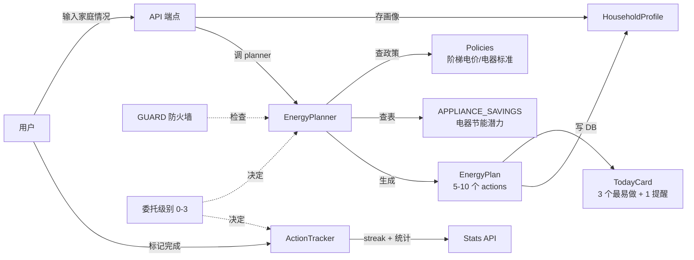

# P12 家庭能源节约规划 — 30 分钟读懂

> 给实习生的入门文档。读完后,你能说出"这个功能做什么、怎么用、关键代码在哪"。

---

## 1. P12 是什么(3 段话)

**P12 解决"知道要节能,但做不到"的问题**。很多人知道空调调高 1 度能省电,但没人告诉"我家"该怎么调、一个月能省多少钱、调了之后效果怎么样。P12 让 AI 根据用户的家庭情况(几口人 / 户型 / 城市 / 电器),生成专属的"今日节能行动卡",用户照做,AI 跟踪,做成习惯。

**核心机制**:不是一次性大改造,而是"每天做 3 件小事"。用户能选 AI 自主程度(委托级别 0-3):老用户让 AI 全部代办,新手让 AI 每步都问。

**业务价值**:1 个家庭每月可省 50-150 元,1 个用户养成 3-5 个节能习惯,3 个月后碳排减 5-15%。这是整个 Agent 的"招牌菜"。

---

## 2. 架构图



---

## 3. 关键文件清单

| 文件 | 作用 |
|---|---|
| `src/agent/energy/models.py` | `HouseholdProfile` / `EnergyAction` / `EnergyPlan` / `TodayCard` 数据类 |
| `src/agent/energy/policies.py` | 7 城市阶梯电价 + 13 电器节能潜力 + `lookup_city_pricing` |
| `src/agent/energy/planner.py` | `EnergyPlanner.generate_plan` + 4 个 GUARD 守卫 + 今日行动卡 |
| `src/agent/energy/tracker.py` | `ActionTracker.mark_completion` + `get_streak` + 统计 |
| `src/agent/energy/delegation.py` | 委托级别 0-3 决策(`decide_for_write` / `should_ask_confirmation`) |
| `src/agent/energy/household_store.py` | `save_profile` / `load_profile` / `save_plan` / 加载 + backfill |
| `src/server/routers/energy.py` | 7 个 API 端点(profile/plan/today/complete/stats/delegation/actions) |
| `src/agent/skills/energy_planning_skill.py` | Skill 包装,让 LLM 能识别和调用 |
| `tests/eval/energy_golden_set.jsonl` | 20 条真实家庭场景,eval 用 |
| `scripts/eval_energy.py` | 跑 eval 评估,输出 hit_rate / hallucination_rate / coverage / realism |

---

## 4. 5 个核心概念(用比喻)

### 委托级别 = 用户给 AI 的驾照等级
- **0**:全权代办(老用户,信任 AI)
- **1**:重要的事问一下(默认,大多数人)
- **2**:给 3 个方案选(喜欢对比的人)
- **3**:只列方案,啥都不动(怕 AI 乱动的人)

**怎么用**:用户聊天中说"以后别问了直接做" → AI 自动把级别改成 0。无需单独 UI。

### 今日节能卡 = 朋友圈打卡卡片
固定 5 字段(学自交小燃的"健康行动卡"):
- 🎯 目标(今日省 X 元 / Y kg CO2)
- 🔌 方案(具体哪 3 件事)
- ⚠️ 提醒(电费异常/季节限电预警)
- ⏰ 时间(峰谷电时段提示)
- ✓ 判定(全做/部分做/未做 三级)

### 幻觉防火墙 = 律师只引用法条不编造
每个 `EnergyAction` 必有 `source_ref` 字段,标明数据来源:
- `policy:knowledge_base/policy/beijing_low_carbon.md`
- `standard:GB-T 18870-2011 节水型产品通用技术条件`
- `appliance:空调(国标 GB 21455-2013)`

**不**用通用知识编造"节电 30%"这种数字。

### 三级完成 = 朋友圈点赞/路过/没看到
- `full`:全做了
- `partial`:做了一部分(也算 streak)
- `none`:没做

**学自交小燃的 streak-as-care**:不做二元判定(今天省没省),让用户"做了一半"也有火花。鼓励长期行为。

### 画像贯通 = 长期记忆
家庭画像(户型/人口/电器/城市/用电习惯)跨模块共享:
- 诊断(节能空间)→ 规划(月度方案) → 模拟(电费预测) → 反馈(实际账单)

使用越久越精准。AI 看你 3 个月数据后,推荐会越来越贴您家。

---

## 5. 10 步快速跑起来

```bash
# 1. 装依赖(已经有了,跳过)
pip install -r requirements.txt

# 2. 跑单元测试(37 个全过)
pytest tests/test_energy_planner.py -v

# 3. 跑端到端测试(54 个全过)
pytest tests/test_energy_e2e.py -v

# 4. 跑幻觉防火墙测试(34 个全过)
pytest tests/test_energy_no_hallucination.py -v

# 5. 跑评估(20/20 全过)
python scripts/eval_energy.py

# 6. 启动服务
cd src && python main.py

# 7. 录入家庭画像
curl -X POST http://localhost:8000/api/energy/profile \
  -H "Authorization: Bearer <your_token>" \
  -H "Content-Type: application/json" \
  -d '{
    "household_size": 3,
    "home_area_sqm": 80,
    "city": "beijing",
    "monthly_electricity_kwh": 320,
    "monthly_water_m3": 10,
    "monthly_gas_m3": 22,
    "appliances": ["空调", "冰箱", "热水器", "洗衣机", "燃气灶"],
    "delegation_level": 1
  }'

# 8. 出方案
curl -X POST http://localhost:8000/api/energy/plan

# 9. 拿今日卡
curl http://localhost:8000/api/energy/today

# 10. 标记完成
curl -X POST http://localhost:8000/api/energy/actions/<id>/complete \
  -d '{"level": "full"}'
```

---

## 6. 4 个常见场景(怎么扩展)

### 加新城市
改 `src/agent/energy/policies.py` 的 `CITY_TIER_PRICING` 字典,加一个 `CityTierPricing` 条目。`city_aliases` 包含中英文,3 档电价。改完跑 `python scripts/eval_energy.py` 验证。

### 加新电器
改 `src/agent/energy/policies.py` 的 `APPLIANCE_SAVINGS` 字典。加一个 `ApplianceSaving` 条目,带 `category` / `difficulty` / `saving_*` 数字 + `source_ref`。

### 改委托级别默认值
改 `models.py` 的 `HouseholdProfile.delegation_level` 默认值(当前 1 = "重要的事问一下")。

### 改"今日行动卡"输出格式
改 `planner.py` 的 `_build_today_card` 方法。可以加字段、加图表、加推荐理由。

---

## 7. FAQ(5 个)

**Q1: 节电数字怎么保证不编造?**
A: 每个 `EnergyAction.saving_*` 字段都从 `APPLIANCE_SAVINGS` 查表,不调 LLM 推断。表里每个数字都有 `source_ref`(政策文件名/国标号)。如果表里没有,planner 不生成该 action,直接走 GUARD 守卫。

**Q2: 委托级别怎么改?**
A: 用户在聊天中自然说"以后这种事别问我" → `parse_level_from_natural_language` 解析,自动改。或者调用 `POST /api/household/delegation` 改。

**Q3: 家庭画像存哪?**
A: `data/households.db` SQLite。`household_profiles` 表存画像,`household_plans` 存方案。`load_profile` 会 backfill 旧数据(没有 warning/blocked 字段)。

**Q4: GUARD 触发后用户怎么知道?**
A: API 返回 200 + `{"blocked": true, "warning": "GUARD_XXX: ...", "plan": null}`。前端用 `blocked` 字段判断,展示 warning 给用户。planner 不会"假装生成"。

**Q5: eval 评估是必须的吗?**
A: 是的。`scripts/eval_energy.py` 输出 4 个核心指标,作为 CI gate。每次改 planner 都跑一遍,防止幻觉回潮。

---

## 8. 推荐阅读顺序

1. 先看 `docs/learning/p9-ocr.md`(项目前 6 个 P 阶段)
2. 再看 `docs/learning/p10-skills-mcp.md`(Skills 框架)
3. 然后看 `docs/learning/p11-productionization.md`(CI + MCP)
4. **最后看本文档**(节能规划核心)
5. 工作部署看 `docs/operations/p12-energy-planning.md`

代码阅读顺序:
- `src/agent/energy/models.py`(数据类)
- `src/agent/energy/policies.py`(政策表)
- `src/agent/energy/planner.py`(核心)
- `src/agent/energy/tracker.py`(跟踪)
- `src/agent/energy/delegation.py`(决策)
- `src/server/routers/energy.py`(API)
- `src/agent/skills/energy_planning_skill.py`(Skill 包装)

---

## 附录:快速对照表

| 概念 | 实现位置 |
|---|---|
| 家庭画像 | `models.HouseholdProfile` |
| 节能方案 | `models.EnergyPlan` |
| 今日行动卡 | `models.TodayCard` |
| 委托级别 | `delegation.py:DelegationLevel` |
| GUARD 常量 | `planner.py:GUARD_*` |
| 城市电价 | `policies.CITY_TIER_PRICING` |
| 电器节能 | `policies.APPLIANCE_SAVINGS` |
| 测试 | `tests/test_energy_*.py` |
| 评估 | `scripts/eval_energy.py` |
