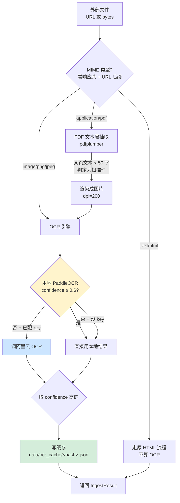

# P9.OCR 学习手册 — 给实习生的 30 分钟入门

> 适用对象:第一次接触本项目的实习生,有 Python 基础,熟悉 HTTP / SQLite / 命令行即可。
> 阅读时间:约 30 分钟。
> 读完之后能回答:**P9 做了什么 / 为什么做 / 在哪里 / 怎么跑**。

---

## 1. P9 是什么

### 痛点(为什么要做 P9)

在做 P9 之前,本项目的知识库只接收"能直接复制粘贴的文字"——也就是 `text/html` 这种结构清晰的网页文本。但政府的真实数据经常不是网页,**而是 PDF 文件或图片**,例如:

- 生态环境部官网的政策原文 PDF(`2024_carbon_market_regulation.pdf`)
- 国家发改委补贴公告的扫描件(图片)
- 各省政府站嵌入 `<iframe>` 的政府公报 PDF

这些"非文本"资源以前全部被丢弃,导致**知识库覆盖度只有 85% 左右**——每 20 篇政策里就有 3 篇被我们"看到了却读不到"。

### 解法(P9 做了什么)

P9.OCR 加了一条新链路:**先把 PDF / 图片变成文字,再入库**。具体做法是:

- PDF 优先抽"文本层"(PDF 自带的可选字符),抽不到就把它当成图片送去 OCR
- 图片直接调 OCR 引擎读出文字
- OCR 同时接两个引擎:本地 PaddleOCR(免费、跑在自家机器)+ 阿里云 OCR(收费、精度高),自动按"置信度"决定用哪个
- 跑过的结果用文件指纹缓存,同一份 PDF 不跑两遍

### 价值

- 知识库覆盖度从约 85% → **接近 100%**
- 政府 PDF 原文 / 扫描件 / 嵌入 PDF 全部可被 RAG 检索
- 自动按置信度切换本地/云端,**没配阿里云 key 也能跑**(只是精度低一些)
- 每天凌晨 02:30 自动增量跑一次,白天不抢资源

---

## 2. 架构图



**两条主要分支**:

- **本地优先(黄)**:PaddleOCR 跑中文场景准确率已经很高,大部分时候能直接命中。
- **云端兜底(蓝)**:只有本地"不够自信"(置信度 < 0.6)时才调阿里云,且阿里云是可选的。
- **缓存(绿)**:不管走哪条路径,最终结果都按 `sha256(内容+MIME)` 落地到 `data/ocr_cache/`,下次同样的文件不再跑。

---

## 3. 关键文件清单

| 文件 | 一句话作用 | 关键类 / 函数 |
|---|---|---|
| `src/ingest/ocr_engine.py` | 对外统一 API,封装"图片/PDF + 路由" | `OCREngine` / `get_ocr_engine()` 单例 |
| `src/ingest/ocr_router.py` | 决策中心:置信度阈值 + 本地/云端路由 | `OCRRouter.route()` / `OCRResult` |
| `src/ingest/image_ocr.py` | 单图片 OCR(PaddleOCR 本地 + 阿里云云端) | `recognize_image_local()` / `recognize_image_cloud()` |
| `src/ingest/pdf_extractor.py` | PDF 文本层提取 + 扫描页 OCR 兜底 | `extract_with_ocr_fallback()` / `save_page_image()` |
| `src/ingest/orchestrator.py` | **统一调用入口**,给 PolicyUpdater / KnowledgeUpdater 用 | `IngestOrchestrator.ingest_url()` / `ingest_bytes()` |
| `src/ingest/ocr_cache.py` | 文件型缓存,按 sha256[:32] 去重 | `OCRCache.get/put/has/stats()` / `get_ocr_cache()` 单例 |
| `src/ingest/html_media_extractor.py` | 从 HTML 里挖出 `/<embed>/<iframe>` 的 URL | `HTMLMediaExtractor.extract()` → `MediaItem` |
| `src/policy/updater.py` | 政策抓取入口,PDF/图片分支调 orchestrator | `_fetch_and_ingest()` |
| `src/knowledge/updater.py` | 知识库更新,提供 `process_pending_ocr()` 供 02:30 调用 | `process_pending_ocr()` |
| `src/scheduler.py` | APScheduler 注册 `_ocr_incremental_job` | 每日 02:30 触发 |
| `config/settings.yaml` | 阈值等配置 | `ocr.confidence_threshold: 0.6` |
| `tests/eval/ocr_golden_set.jsonl` | 20 条 PDF/图片评估集(黄金集) | 每行:`{id, file, expected_text, expected_keywords, tolerance}` |
| `tests/eval/ocr_samples/` | 评估用的样本文件 | 数字 PDF / 扫描 PDF / 文字图片 混合 |

**调用链一句话总结**:`scheduler / updater → orchestrator.ingest_url() → (缓存命中? → 返 : OCREngine → OCRRouter → image_ocr / pdf_extractor) → 写缓存 → 返 IngestResult`。

---

## 4. 三个核心概念(用比喻)

### 4.1 OCR 路由 = 两个医生会诊

想象你拿了一张模糊的化验单去医院:

- **第一个医生** = PaddleOCR(本地),免费、快,但遇到模糊的片子可能看错
- **第二个医生** = 阿里云 OCR(云端),收费、慢,但读疑难杂症更准

流程是:先让第一个医生看,**他有信心(confidence ≥ 0.6)就直接信他**;**没信心就让第二个医生再看一遍,两个结果里挑更自信的**。第二个医生没排班(没配 key)的话,就直接用第一个医生的结果,不会报错。

代码对应:`OCRRouter.route(local_result, cloud_result_factory=...)`,决策点是 `should_use_cloud()`。

### 4.2 置信度 = 医生的"自信分"

OCR 引擎每识别一行字都会返回一个 0~1 的小数,代表它有多确定这个字是对的(1.0 = 100% 确定)。PaddleOCR 给的是单字置信度,我们取整页平均。

- 本地页 confidence ≥ 0.6 → 直接用,标 `engine=paddleocr`
- 本地页 confidence < 0.6 且 key 齐 → 调阿里云,标 `engine=hybrid(cloud)`
- 没 key → 降级用本地结果,**`used_fallback=False`**,只是精度差些

阈值在 `config/settings.yaml → ocr.confidence_threshold` 调,默认 0.6。

### 4.3 内容指纹 = 文件的"身份证号"

用 `sha256(文件内容 + MIME 类型)` 取前 32 位 hex,作为这个文件的唯一标识。同一个 PDF 不管从哪里来、什么时候来,只要字节没变,就跳过 OCR 直接返上次结果。

`OCRCache.compute_hash(content, mime)` 是计算入口,缓存文件存在 `data/ocr_cache/<hash>.json`。这是为什么**重复抓同一份政府文件几乎零成本**——第一次跑过,之后秒返。

---

## 5. 快速跑起来(10 步)

```bash
# 1) 安装依赖(PaddleOCR 首次装会下载 ~300MB 模型)
pip install -r requirements.txt

# 2) 可选:配阿里云 key(不配也能跑,只是精度差)
# 在 .env 里加:
#   ALIYUN_OCR_KEY=<你的 access key>
#   ALIYUN_OCR_SECRET=<你的 secret>
# 留空 → 自动降级用本地 PaddleOCR

# 3) 跑 P9 单元测试
pytest tests/test_ocr_engine.py -v
pytest tests/test_ocr_ingestion.py -v

# 4) 跑评估(对比黄金集)
python scripts/eval_retrieval.py --subset ocr
# 看 hit_rate / MRR / NDCG

# 5) 看缓存目录
ls data/ocr_cache/
# 空 → 说明还没跑过 OCR

# 6) 手动触发一次(可选)
python -c "from knowledge.updater import KnowledgeUpdater; print(KnowledgeUpdater().process_pending_ocr())"

# 7) 启动主服务
cd src && python main.py
# 访问 http://localhost:8000/api/health 确认 OK

# 8) 验证 PDF 入库:把政府 PDF URL 喂给政策同步
curl -X POST http://localhost:8000/api/policy/check-updates -d '{}' -H "Content-Type: application/json"

# 9) 看日志
tail -f data/logs/app.log | grep -i ocr

# 10) 清理测试缓存(慎用)
python -c "from ingest.ocr_cache import get_ocr_cache; print(get_ocr_cache().clear())"
```

**预期时间**:第 1 步装依赖最慢(~5 分钟,模型下载),后续每一步秒级。

---

## 6. 怎么扩展(常见场景)

### 场景 A:加一个新的 OCR 引擎(比如腾讯云 OCR)

步骤:

1. 在 `src/ingest/` 下新建 `tencent_ocr.py`,模仿 `image_ocr.py` 的 `_AliyunOCREngine` 写一个 `_TencentOCREngine`(懒加载 + `available` 属性 + `recognize()` 方法)
2. 在 `ocr_router.py` 的 `OCREngineType` 枚举里加 `TENCENT = "tencent"`
3. 在 `OCRRouter.is_cloud_available()` 加腾讯云 key 的环境变量检查
4. 在 `OCREngine.recognize_image()` 的 `_call_cloud` 工厂里按优先级调多个云端
5. 在 `requirements.txt` 加 `tencentcloud-sdk-python-ocr`
6. 在 `tests/test_ocr_engine.py` 加一个 mock 测试

### 场景 B:支持新的文件类型(比如 .docx / .xlsx)

1. 在 `orchestrator.py` 加 `_is_docx(mime, url)` 判断函数
2. 在 `ingest_bytes()` 加分支调 `python-docx` / `openpyxl`
3. 注意:**不需要走 OCR**(这些格式自带文字),直接抽文本即可
4. 缓存逻辑不变(还是用 `sha256(内容+MIME)`)

### 场景 C:改缓存策略

`ocr_cache.py` 当前是**纯文件型、无 TTL、无容量上限**。要改:

- **加 TTL**:在 `OCRCache.put()` 写一个 `saved_at`,`get()` 时检查 `now - saved_at < ttl_days`,过期返 None
- **加容量上限**:LRU 策略,`stats()` 后 `clear()` 最老的 N 个
- **换 Redis**:替换 `_path_for()` 为 `redis.set(key, payload, ex=...)`,接口签名保持兼容即可

### 场景 D:修一个 OCR 识别错误的 bug

定位顺序:

1. 看 `data/logs/app.log` 的 `[OCRRouter] ... ` / `[PaddleOCR] ...` 行,确认是哪个引擎错
2. 看 `data/ocr_cache/<hash>.json` 的 `engine` / `confidence` / `text` 字段,复现 OCR 输出
3. 如果本地引擎问题 → 调 `config/settings.yaml → ocr.confidence_threshold` 降低(比如 0.5),让更多走云端
4. 如果是路由逻辑问题 → 看 `ocr_router.py` 的 `should_use_cloud` / `merge_results`
5. 加测试:`tests/test_ocr_engine.py` 新建一条,注入 mock 的 `OCRResult`

---

## 7. 常见问题 FAQ

**Q1:第一次跑 OCR 很慢,卡在 "正在初始化"?**

A:正常。PaddleOCR 首次加载会从服务器下载约 300MB 的中文识别模型,之后会缓存到 `~/.paddleocr/`。**第一次慢,后面秒级**。可以提前 `python -c "from paddleocr import PaddleOCR; PaddleOCR(lang='ch')"` 预热。

**Q2:阿里云 key 没配会怎样?**

A:自动降级用本地 PaddleOCR,**不会报错**。日志里会看到 `[OCRRouter] 置信度 X < 0.6 但云端 key 未配置,降级使用本地结果`。结果就是:政府 PDF 里如果扫描模糊,本地识别可能丢几个字,而不是完全失败。

**Q3:为什么 OCR 任务安排在凌晨 02:30?**

A:避开每天 02:00 的 `_daily_kb_update`(主知识库抓取)+ 03:00 的 `_memory_decay`(记忆衰减),**串行排队、互不抢资源**。而且凌晨没人用,跑 10 分钟慢点也无所谓。

**Q4:置信度阈值怎么调?**

A:改 `config/settings.yaml` 里 `ocr.confidence_threshold`,默认 `0.6`。**调高**(比如 0.8)→ 更多走云端,精度更高但费用涨;**调低**(比如 0.4)→ 更信任本地,省钱但低质量 PDF 可能识别差。生产环境建议 0.6,评估时跑 `tests/eval/ocr_golden_set.jsonl` 对比 `hit_rate`。

**Q5:OCR 失败的 PDF 怎么办?**

A:分三步看:

1. `data/logs/app.log` 搜 `ocr_failed` / `recognize_failed`,看错误类型
2. `data/ocr_cache/<hash>.json` 看上一次识别结果(`error` 字段会写原因)
3. 如果是扫描件 + 本地识别差,可以临时设 `ALIYUN_OCR_KEY` 让云端兜底;或者人工导出 PDF 文字重新入库

---

## 8. 推荐阅读顺序(给实习生)

如果你完全没接触过本项目,按这个顺序看:

1. **`README.md`**(项目根)—— 5 分钟,了解项目目标和 quickstart
2. **`CLAUDE.md`**(项目根)—— 30 分钟,看完整架构图 + 模块说明
3. **本文档**(`docs/learning/p9-ocr.md`)—— 30 分钟,聚焦 P9
4. **`src/ingest/__init__.py`** —— 5 分钟,看包导出
5. **`src/ingest/orchestrator.py`** 的 `ingest_url()` —— 顺着入口读主流程
6. **`src/ingest/ocr_router.py`** —— 读路由决策逻辑
7. **`src/ingest/ocr_cache.py`** —— 读缓存设计
8. **`tests/test_ocr_engine.py`** + **`tests/test_ocr_ingestion.py`** —— 看测试怎么 mock
9. **`tests/eval/ocr_golden_set.jsonl`** —— 看评估样本格式

**跑起来之前**:确保 `pip install -r requirements.txt` 已经完成,不然 `import paddleocr` 会报错。

**上手第一个 PR 建议**:在 `tests/test_ocr_engine.py` 加一个用 mock 工厂的测试,验证 `OCRRouter` 在 "本地高 confidence + 有 cloud factory" 场景下不调云端。这个改动小、好 review、能帮你吃透路由逻辑。

---

## 附录:快速对照表

| 想做的事 | 改哪个文件 |
|---|---|
| 调 OCR 阈值 | `config/settings.yaml` → `ocr.confidence_threshold` |
| 加新 OCR 引擎 | `src/ingest/<name>_ocr.py` + 注册到 `ocr_router.py` |
| 加新文件类型 | `src/ingest/orchestrator.py` 加 MIME 分支 |
| 调缓存策略 | `src/ingest/ocr_cache.py` |
| 看 OCR 跑没跑 | `data/logs/app.log` 搜 `ocr` / `data/ocr_cache/*.json` |
| 看评估分数 | `python scripts/eval_retrieval.py --subset ocr` |
| 改调度时间 | `src/scheduler.py` 的 `CronTrigger(hour=2, minute=30, ...)` |
| 集成到知识库 | `src/knowledge/updater.py` 的 `process_pending_ocr()` |
| 集成到政策抓取 | `src/policy/updater.py` 的 `_fetch_and_ingest()` |

---

*版本:v1.0 | 创建于 P9.OCR 完成时 | 维护者:文档工程师*