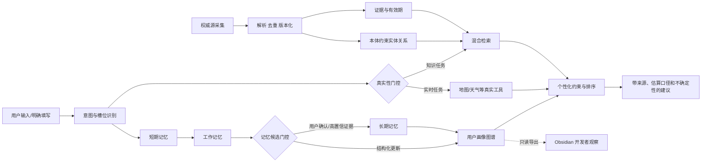

# 绿色低碳智能体：可信知识、分层记忆与个性化服务架构

## 1. 研究问题

本系统研究的不是“让大模型回答环保问题”，而是三个可检验的问题：

1. 如何让低碳建议只基于可追溯知识和真实工具数据，降低事实幻觉；
2. 如何从多轮对话中形成可修正、可遗忘、可解释的用户画像；
3. 如何让知识与画像共同改变建议内容和行动难度，缩小用户的低碳知行鸿沟。

建议论文题目：**面向个性化绿色低碳行为促进的本体约束检索增强与分层记忆智能体研究**。

## 2. 当前系统的真实基线

### 2.1 知识库

当前知识库共有 70 篇 Markdown，其中 7 篇位于隔离/内部目录，不进入生产索引；生产候选为 63 篇。目录分为 basic、guide、policy/policies、evidence 和增量更新。RAG 按 Markdown 标题进行一级切分，再以 1200 字符、150 字符重叠进行二级切分；检索由向量召回和 BM25 混合完成，可选 BGE 精排。向量索引保存在 ChromaDB，更新事件触发增量加入或重建。

现有精选评测集含 33 个问题，报告结果为 Hit@5=1.0000、MRR@10=0.8232、NDCG@10=0.8681。该结果只说明“预期文档能否被召回”，不说明文档内容真实、最新或足以支持答案。

首次审计时，69 篇文档中完整包含来源网址、发布者、发布时间、抓取时间、内容哈希、权威等级和有效期的文档为 0。2026-09-10 完成第一轮治理后，63 篇生产候选中已有 1 篇权威等级 A 的历史数据条目完整可追溯，覆盖率为 1.59%；其余 62 篇仍为未验证。当前最大风险因此仍是**高召回率建立在低证据治理质量之上**。

### 2.2 GraphRAG

当前 GraphRAG 从段落中匹配固定关键词实体，并以同段共现建立关系。查询命中实体后返回实体所在段落。它具备图数据结构和简单多跳遍历，但共现边不等于事实关系，也没有实体消歧、关系置信度、证据边、时间有效性和本体约束。因此论文中应称为“关键词共现图基线”，不能直接称为完整的本体知识图谱。

### 2.3 分层记忆与画像

当前数据流包括：

- 会话状态：ConversationStore，按用户维护会话并设置 7 天 TTL；
- 短期记忆：SQLite 保存对话消息和摘要；
- 工作记忆：按用户保存当前任务的键值状态，有容量与 TTL；
- 长期记忆：SQLite + 向量召回，保存被整合的偏好和事实，并按半衰期衰减；
- 用户画像：结构化字段 + 画像图谱，包含兴趣、行动、目标、成就和碳足迹；
- Obsidian：画像的只读观察投影，供开发者查看，不作为运行时真相源。

已有架构的优点是存储层次齐全；主要缺口是“消息何时能成为画像事实”的门控不足。对话推断、用户明确填写、用户确认和行为证据目前没有统一的来源优先级、冲突处理和可撤销版本。

## 3. 目标架构

### 3.1 双图模型

领域知识图描述“客观世界”：政策、地区、交通方式、家庭设备、资源、行为、排放因子、指标和证据。用户画像图描述“该用户”：家庭人数、设备、习惯、预算、目标、行为阶段、已接受/拒绝建议和实际行动。

两张图通过 `personalizes` 和 `applicable_to` 一类边连接。例如：

`用户-拥有设备->空调`，`空调-has_factor->单位耗电`，`设定26℃-reduces->空调用电`，`建议-personalizes->用户行为阶段`。

这种设计避免把私人画像混入公共知识，也能解释一条建议为何适合某个用户。

### 3.2 知识获取与更新

建议采用如下流水线：

1. 来源登记：保存 URL、发布机构、来源类型、地区、检查频率和权威等级；
2. 原始快照：保存抓取时间、HTTP 状态、正文和 SHA-256，不覆盖历史版本；
3. 内容解析：抽取标题、发布日期、文号、适用地区、有效期、指标与原文段落；
4. 本体映射：实体和关系只能落入版本化受控类型；无法验证的关系标记为候选；
5. 证据绑定：每个事实边必须指向原文片段、来源版本和抽取方式；
6. 冲突处理：新旧政策或排放因子并存，通过 `valid_from/valid_to/supersedes` 选择当前版本；
7. 增量索引：只更新受影响文档块、实体、关系和向量；
8. 发布门控：来源缺失、正文过短、时间异常或关键字段缺失时进入隔离区，不进入生产检索。

仓库现已增加 `config/low_carbon_ontology.yaml`、`src/knowledge/ontology.py` 和 `scripts/audit_knowledge_base.py`。这是受控词表与溯源审计的第一版，还不是已经完成的知识图谱数据库。

### 3.3 记忆沉淀协议

每条长期事实应包含：`value`、`source`、`confidence`、`observed_at`、`confirmed_at`、`expires_at`、`supersedes` 和 `sensitivity`。

建议的优先级：用户本次明确填写 > 用户确认过的信息 > 多次一致的行为证据 > 单次对话推断 > 模型猜测。模型猜测不能直接成为画像事实。

更新流程：消息先产生“记忆候选”；候选经结构校验、重复合并、冲突检测和置信度门控后，才更新长期记忆与画像图。涉及家庭人数、地址、设备所有权等高影响字段时，如与现有事实冲突，应向用户确认。Obsidian 只显示事实、来源、置信度和变更历史。

## 4. 从开源智能体借鉴什么

| 项目 | 核心机制 | 本项目应吸收 | 不应照搬 |
|---|---|---|---|
| [Microsoft GraphRAG](https://github.com/microsoft/graphrag) | 从非结构化文本抽取实体、关系、声明和社区报告；支持 Local、Global、DRIFT 查询 | 事实声明与证据绑定；根据问题类型选择局部实体检索或全局主题检索 | 小语料直接做昂贵的全量社区摘要 |
| [LightRAG](https://github.com/HKUDS/LightRAG) | 图结构与向量双层索引，强调低成本增量更新 | 文档、实体、关系和向量的增量同步 | 只追求图规模，不做权威性和时效性治理 |
| [LangGraph](https://github.com/langchain-ai/langgraph) | 线程状态、checkpoint、跨线程 namespace memory、失败恢复与人工介入 | 统一状态机；明确线程记忆与跨线程记忆；在高影响画像冲突处加入确认节点 | 同时维护两条行为不同的编排路径 |
| [LangGraph Memory Service](https://github.com/langchain-ai/langgraph-memory) | 从会话抽取记忆、去重、持续更新 schema、区分 schema memory 与 event memory | 记忆候选、去重、事实型画像与事件型行为分开保存 | 对每句话都写长期记忆 |
| [Mem0](https://github.com/mem0ai/mem0) | 独立的持久记忆层、按用户检索、自托管与审计 | 将画像更新做成独立可评测服务；记录每次增删改 | 仅凭向量相似度解决事实冲突 |
| [Letta](https://github.com/letta-ai/letta) | 有界核心记忆与可检索归档记忆，Agent 可管理自己的记忆 | prompt 中只放紧凑画像摘要，详细历史按需召回 | 允许模型无审计地改写关键用户事实 |

共同的“神”是：智能体由显式状态、真实工具、可恢复执行、受治理记忆和评测闭环组成。多一个聊天入口、一个图页面或一个提示词并不会形成这种能力。

## 5. 论文实验设计

### 5.1 消融组

- B0：纯大模型；
- B1：向量 RAG；
- B2：向量 + BM25；
- B3：混合 RAG + 本体约束图检索；
- B4：B3 + 分层记忆；
- B5：B4 + 用户画像个性化排序。

### 5.2 指标

- 知识检索：Hit@5、MRR@10、NDCG@10；
- 事实可信：来源覆盖率、声明证据支持率、过期知识命中率、幻觉率；
- 个性化：用户约束满足率、画像事实准确率、冲突更新正确率、建议重复率；
- 行为促进：建议接受率、计划完成率、自报节能/减碳量；
- 系统：成功率、P95 延迟、单次调用成本、工具故障时虚假成功率；
- 隐私：跨用户泄漏率、敏感字段未经确认写入率。

### 5.3 数据集

在现有精选检索集之外，新增四类集合：有明确权威原文的事实问答；包含新旧政策冲突的时序问答；包含家庭与出行约束的个性化场景；真实工具故障、限流和歧义地点的可靠性场景。每个样本保存期望证据、允许的不确定性和禁止生成的字段。

## 6. 实施顺序

1. 完成路线服务连通性、供应商健康检查和真实出行端到端演示；
2. 给全部知识文档补来源与版本元数据，将未通过门控的文档移出生产索引；
3. 把共现图升级为“事实边—证据片段—来源版本”的本体图；
4. 实现记忆候选、冲突、确认、撤销和来源优先级；
5. 统一传统编排与 LangGraph 路径，确保同一输入得到相同的真实性门控；
6. 扩充评测集并完成 B0–B5 消融实验。

当前最适合对外表述的是：系统已经具备混合知识检索、分层记忆、画像图谱、家庭节能与真实路线工具的工程骨架；真实路线已禁止模拟降级；本体和溯源治理已启动，但知识证据质量与真实供应商连通性尚未达到论文完成态。
